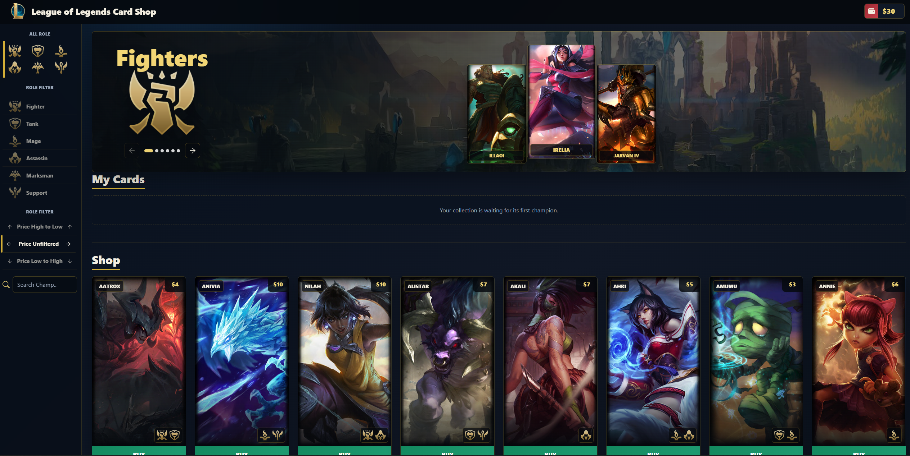

# League of Legends Card Market

Responsive League of Legends card market built with React.  
You can browse champions, filter by role/price/search, buy and sell cards with wallet logic, and open champion detail modals with skills and lore.

Live demo: [League of Legends Card Market](https://ismailcubuk.github.io/LeagueOfLegends-Card-Market/)



## Features

- Champion card marketplace (buy/sell flow)
- Wallet balance tracking
- Role-based filtering
- Price sorting (high to low / low to high / unfiltered)
- Search by champion name or id
- Pagination for shop cards
- “My Cards” collection section
- Carousel by role groups
- Champion detail modal (splash image, short story, passive + spells)
- Mobile fixed bottom filter bar (price/search/class)
- Responsive layout for desktop and mobile
- Local persistence with `localStorage`

## Tech Stack

- React 18
- JavaScript
- CSS
- React Bootstrap (Modal)
- React Icons
- Riot Data Dragon API (champion data/images)

## Project Structure

```text
src/
  components/
    Body/
      Alert/
        Alert.js
        Alert.css
      Cards/
        MappedCard.js
        Cards.css
      Carousel/
        Carousel.js
        Carousel.css
      Navbar/
        Navbar.js
        Wallet.js
        navbar.css
      Pagination/
        Pagination.js
        pagination.css
      Sidebar/
        Sidebar.js
        sidebar.css
    component/
      CardContext.js
      Lol.json
  Images/
    Passive/
    Skills/
    Stats/
  App.js
  index.js
  index.css

public/
  index.html
  manifest.json
  robots.txt
  favicon.ico
