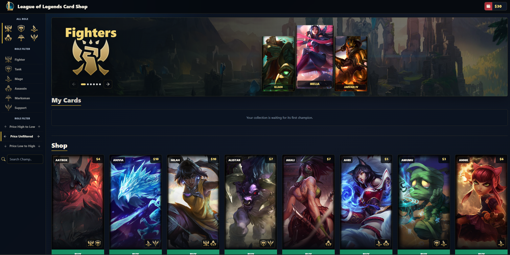

# League of Legends Card Market

Responsive League of Legends card market application built with React. Users can browse champion cards, filter and search champions, buy and sell cards with wallet logic, open card packs, manage their collection, and inspect champion details with abilities, lore, rarity, region, and visual assets.

Live demo: [League of Legends Card Market](https://ismailcubuk.github.io/LeagueOfLegends-Card-Market/)



## Features

- Public marketplace homepage with champion card listings
- Champion detail modal with splash image, lore, passive, and skills
- Role, price, search, and sorting filters
- Champion archive-style browsing by class and role groups
- Buy and sell card workflow with wallet balance tracking
- "My Cards" collection area for owned champions
- Favorites panel for saved champion cards
- Cart panel for selected cards
- Pack opening experience with animated overlays
- Trending champion carousel
- Profile showcase and collection management
- Champion rarity badges and price metadata
- Blue Essence themed price display
- Responsive desktop and mobile layouts
- Mobile fixed bottom filter bar
- Local persistence with `localStorage`
- Riot Data Dragon based champion media and data usage

## Tech Stack

- React 18
- Create React App
- JavaScript
- CSS
- Bootstrap
- React Bootstrap
- React Router DOM
- React Icons
- Lucide React
- Framer Motion
- Axios
- Riot Data Dragon API
- GitHub Pages

## Project Structure

```text
src/
  app/
    App.js

  components/
    common/
      BlueEssenceIcon.js
      PriceAmount.js
      RarityPill.js
    effects/
      FlightEffects.js
    layout/
      Topbar.js
    feedback/
      Alert/
    pagination/
      Pagination/
    Body/
      Cards/
      Carousel/
      Navbar/
      Sidebar/

  config/
    navigation.js
    profileIcons.js

  context/
    CardContext.js

  data/
    championOrigins.js
    Lol.json

  domain/
    championPrices.js

  features/
    cart/
      CartPanel.js
    collection/
      HomeMyCardsSection.js
    favorites/
      FavoritesPanel.js
    filters/
      FilterPanel.js
      FilterSection.js
    hero/
      HeroSection.js
      HeroStat.js
    market/
      ChampionCard.js
      TrendingCarousel.js
    pack/
      PackOpeningSection.js
      PackOverlays.js
    preview/
      ChampionPreviewModal.js
    profile/
      CollectionPanel.js
      ShowcasePickerModal.js

  hooks/
    useBodyScrollLock.js

  styles/
    index.css

  utils/
    championMedia.js
    championMeta.js
    packOpening.js

  Images/
    Passive/
    Skills/
    Stats/

  index.js

public/
  index.html
  manifest.json
  robots.txt
  favicon.ico
  regions/
  images/
```

## Demo

The live version is published with GitHub Pages:

- Live: [https://ismailcubuk.github.io/LeagueOfLegends-Card-Market/](https://ismailcubuk.github.io/LeagueOfLegends-Card-Market/)
- Repository homepage path: `/LeagueOfLegends-Card-Market`

## Main Screens

| Screen | Description |
| --- | --- |
| Home | Main marketplace and hero area |
| Champion Cards | Browse available champion cards |
| Filters | Filter by role, class, price, and search text |
| Champion Detail | View champion splash, lore, passive, and skills |
| My Cards | View owned champion cards |
| Favorites | Manage favorite champion cards |
| Cart | Review selected cards |
| Pack Opening | Open card packs and reveal champions |
| Profile Showcase | Manage showcased collection items |

## Code Organization

- `src/app/App.js` owns the main application flow and composes the marketplace sections.
- `src/components` contains shared UI, layout, feedback, pagination, and legacy Body components.
- `src/components/common` contains reusable visual helpers such as price, rarity, and Blue Essence display components.
- `src/features` groups feature-level UI such as market, filters, cart, favorites, pack opening, profile, and champion preview.
- `src/context` contains global card state and marketplace logic.
- `src/domain` contains champion pricing and domain-specific helpers.
- `src/data` contains local champion metadata and origin mapping.
- `src/utils` contains reusable helper logic for champion media, metadata, and pack opening.
- `src/styles` contains global application styles.
- `public/images` and `public/regions` contain static visual assets used by the app.

